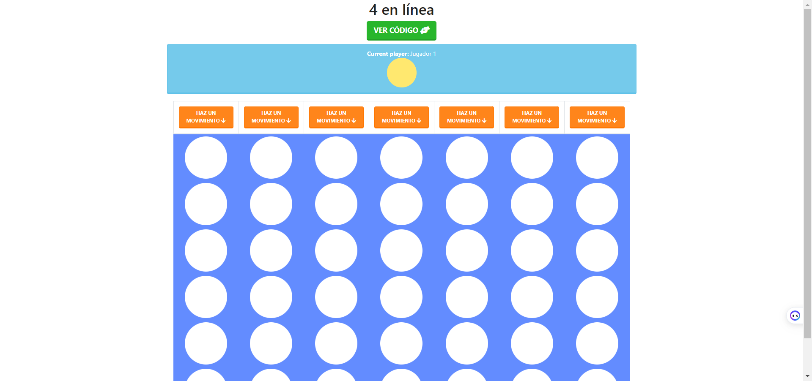

  # 4 en Línea

Este es un juego de 4 en línea desarrollado en JavaScript.

## Características

- Permite jugar contra otro jugador local o contra la CPU.
- La CPU utiliza una estrategia de juego basada en algoritmo para tomar decisiones.
- El tablero y las fichas se representan visualmente en el navegador mediante HTML y CSS.

## Instalación

1. Clona o descarga el repositorio en tu máquina local.
2. Abre el archivo `index.html` en tu navegador web.

## Uso

- Para jugar contra otro jugador local, selecciona la opción correspondiente y luego realiza tus movimientos, el juego alterna entre los jugadores.
- Para jugar contra la CPU, selecciona la opción correspondiente y luego realiza tus movimientos como jugador humano, la CPU jugará automáticamente. 

 ## Personalización

Puedes personalizar el juego del ahorcado modificando el archivo `index.html` y el archivo ` connect4.js`.
  
## Tecnologías utilizadas

Este conversor fue construido utilizando HTML, CSS y JavaScript.

## Demo del código

Puedes ver el resultado final del código aquí: https://demos-github-jl.000webhostapp.com/4_en_raya_juego_con_js/
  
  
## Contribución

Las contribuciones son bienvenidas. Si deseas mejorar el juego, por favor sigue estos pasos:

1. Realiza un fork del repositorio.
2. Crea una rama con tu nueva característica (git checkout -b nueva-caracteristica).
3. Realiza tus cambios y commitea (git commit -am 'Agrega nueva característica').
4. Haz push a la rama (git push origin nueva-caracteristica).
5. Abre un Pull Request en GitHub.

## Licencia
Este proyecto está bajo la Licencia MIT. Consulta el archivo LICENSE para obtener más información.
  
## Captura del proyecto

  
  

